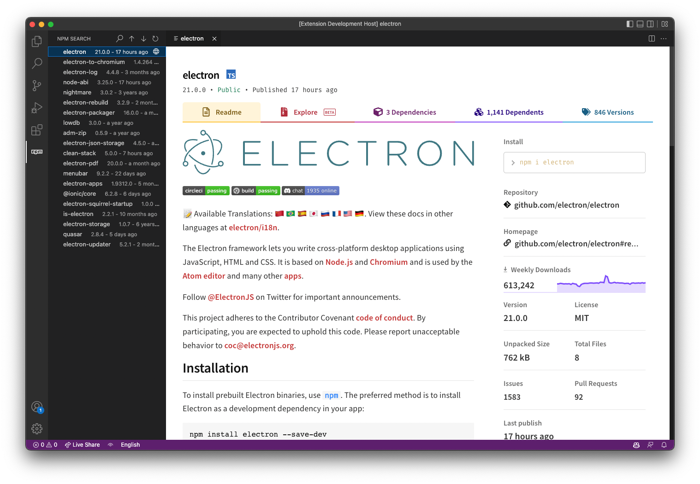

# npm-search-vscode

Search Node packages in Visual Studio Code.



## Installation

[npm search](https://marketplace.visualstudio.com/items?itemName=TaipaXu.npm-search)

## Development & Building

### Prerequisites

- Node.js 24.17.0
- pnpm 11.5.2

```sh
$ corepack enable
$ corepack prepare pnpm@11.5.2 --activate
$ git clone https://github.com/TaipaXu/npm-search-vscode
$ cd npm-search-vscode
$ pnpm i
```

### Development

```sh
$ pnpm run dev
```

### Type Checking

```sh
$ pnpm run type-check
```

### Linting & Formatting

```sh
$ pnpm run check
$ pnpm run format
```

### Building

```sh
$ pnpm run build
```

### Packaging

```sh
$ pnpm run package
```

## License

[GPL-3.0](LICENSE)
